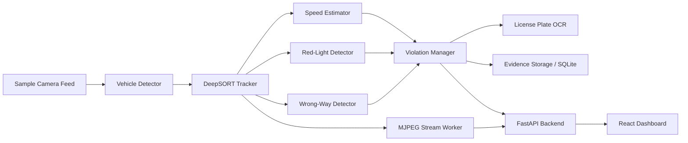

# TraffWise

TraffWise is a full-stack traffic monitoring system built with computer vision, FastAPI, and React. It processes traffic-camera feeds, tracks vehicles, detects traffic violations (speeding, red-light running, wrong-way driving), performs license plate OCR, and streams annotated video feeds to a real-time web dashboard.

## Demo

> [!NOTE]
> Below are preview assets demonstrating the live dashboard and vehicle monitoring pipeline.

[](https://github.com/khoa-na/TraffWise)
*Click the thumbnail above to watch the full system demonstration video.*


*Real-time multi-camera monitoring view with vehicle tracking, speed estimation, and lane overlay.*


*Detailed violation view featuring vehicle snapshot, speed calculation, and license plate OCR recognition.*

---

## Features

- **Multi-Model Vehicle Detection**: Support for YOLO11, RT-DETRv2, and Faster R-CNN detectors.
- **Robust Tracking**: DeepSORT multi-object tracking for frame-to-frame vehicle persistence.
- **Traffic Violation Suite**: Speed estimation, red-light violation, and wrong-lane driving detection.
- **Automated License Plate Recognition**: License plate detection and EasyOCR text extraction.
- **Interactive Web Dashboard**: React frontend for camera switching, parameter tuning, and violation report generation.
- **CPU & NVIDIA GPU Support**: Optimized execution pipeline for both CPU and CUDA-accelerated hardware.

---

## Quantitative Evaluation & Model Selection

### Detector Accuracy Benchmark

Evaluation performed on validation split (best epoch selected by validation mAP50-95):

| Model | Precision | Recall | mAP50 | mAP50-95 | Weight Size | Framework |
|---|---:|---:|---:|---:|---:|---|
| **YOLO11** (Selected Default) | **0.8678** | **0.8538** | **0.9273** | **0.7521** | 5.5 MB | Ultralytics / PyTorch |
| **RT-DETRv2** | 0.8452 | 0.8017 | 0.8625 | 0.6285 | 5.9 MB | PyTorch |
| **Faster R-CNN** | 0.3471 | 0.3641 | 0.9015 | 0.6649 | 65.2 MB | torchvision |
| **License Plate Detector** | 0.9912 | 0.9889 | 0.9942 | 0.8350 | 5.4 MB | Ultralytics / PyTorch |

### Model Selection Rationale

- **Default Model**: **YOLO11** is chosen as the default real-time detector because it achieves the highest mAP50-95 (**0.7521**) and mAP50 (**0.9273**) while maintaining a compact weight size of **5.5 MB** and low inference latency.
- **Transformer Alternative**: **RT-DETRv2** provides end-to-end NMS-free detection but trades off slightly lower mAP50-95 on the validation split.
- **Two-Stage Comparison**: **Faster R-CNN** achieves reasonable mAP50 (0.9015) but requires significantly larger memory overhead (65.2 MB) and higher inference latency.
- **Pipeline Bottlenecks**: In CPU mode, license plate crop OCR and MJPEG frame encoding are the primary processing bottlenecks; GPU mode accelerates both object detection and feature extraction.

---

## Architecture & System Design



### Component Responsibilities

- **`VehicleDetector`**: Unified wrapper normalizing bounding box predictions across YOLO11, RT-DETRv2, and Faster R-CNN.
- **`DeepSORT`**: Maintains object track identities across consecutive video frames.
- **`RoadManager`**: Parses camera-specific road geometries, lane boundaries, and perspective transform matrices.
- **`SpeedEstimator`**: Maps pixel displacements to ground distances to estimate speed in km/h.
- **`Violation Detectors`**: Evaluates track trajectories against red-light zones, speed limits, and directional vectors.
- **`LicensePlateProcessor`**: Crops vehicle license plate regions and executes EasyOCR text extraction.
- **`ViolationManager`**: Deduplicates violation events and persists records to SQLite.
- **`MJPEG Stream Worker`**: Single background producer serving frame buffers to multiple connected web clients.
- **FastAPI / React**: RESTful API control plane and interactive user dashboard.

### System Lifecycle & Trade-Offs

- **Model Initialization**: Pretrained models are loaded into memory on backend startup; model switching reuses memory pools.
- **Camera Switching**: Switching cameras resets DeepSORT track IDs and loads camera-specific lane annotations and perspective calibrations.
- **Stream Concurrency**: A single background producer thread processes frames and encodes MJPEG buffers shared across all connected clients.
- **Known Limitations**: Demo videos use fixed sample files; speed estimation accuracy depends on perspective calibration quality; OCR accuracy degrades under extreme blur or low light.

---

## Repository Layout

```text
backend/                 FastAPI API and computer-vision pipeline
  api/configs/           Runtime configuration
  api/data/              Downloaded weights and videos (excluded from git)
  api/source/            Detection, tracking, OCR, and violation logic
frontend/                React dashboard
notebooks/               Training and evaluation notebooks & CSV logs
scripts/download_assets.py Asset verification and download helper
assets-manifest.json     Pinned asset SHA-256 manifest
docker-compose.yml       CPU-compatible container orchestration
docker-compose.gpu.yml   NVIDIA GPU override configuration
```

---

## Prerequisites

- **Git**
- **Python 3.9+** (used for asset downloader script)
- **Docker Engine & Docker Compose Plugin** (or Docker Desktop)
- Free disk space: **12 GB minimum** (20 GB recommended for build cache)

---

## Quick Start: CPU

1. **Clone the repository**:
   ```bash
   git clone https://github.com/khoa-na/TraffWise.git
   cd TraffWise
   ```

2. **Download and verify asset bundle**:
   ```bash
   python3 scripts/download_assets.py
   ```

3. **Start services**:
   ```bash
   docker compose up -d --build
   ```

4. **Access web interfaces**:
   - Dashboard: <http://localhost:3200>
   - Swagger API docs: <http://localhost:8000/docs>
   - OpenAPI schema: <http://localhost:8000/openapi.json>

---

## Quick Start: NVIDIA GPU

1. **Verify GPU availability in Docker**:
   ```bash
   nvidia-smi
   docker run --rm --gpus all nvidia/cuda:12.8.1-base-ubuntu24.04 nvidia-smi
   ```

2. **Launch with GPU override**:
   ```bash
   docker compose -f docker-compose.yml -f docker-compose.gpu.yml up -d --build
   ```

3. **Confirm PyTorch CUDA detection**:
   ```bash
   docker compose exec backend python -c \
     "import torch; print(torch.__version__); print(torch.cuda.is_available()); print(torch.cuda.get_device_name(0))"
   ```

---

## Environment & Cloudinary Setup

Local evidence storage works out of the box. Optional Cloudinary integration for cloud evidence hosting can be configured via `.env`:

```bash
cp .env.example .env
```

Set the following variables in `.env`:
```dotenv
CLOUDINARY_CLOUD_NAME=your-cloud-name
CLOUDINARY_API_KEY=your-api-key
CLOUDINARY_API_SECRET=your-api-secret
```

---

## Useful Commands

- **Verify downloaded asset checksums**:
  ```bash
  python3 scripts/download_assets.py --verify-only
  ```
- **Check container status**:
  ```bash
  docker compose ps
  ```
- **View backend logs**:
  ```bash
  docker compose logs -f --tail=100 backend
  ```
- **Stop containers**:
  ```bash
  docker compose down
  ```

---

## License & Data Attribution

- **Code License**: Source code is licensed under the [MIT License](LICENSE).
- **Model Weights & Sample Media**: Distributed separately via Hugging Face [`khoa-na/traffwise-assets`](https://huggingface.co/datasets/khoa-na/traffwise-assets).
- **Dataset Attribution**: External datasets and baseline pre-trained model weights retain their respective original licenses and usage terms.
