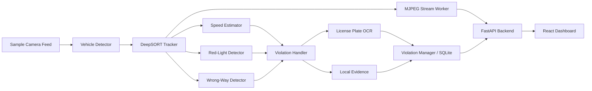

# TraffWise

TraffWise is a full-stack computer-vision system for processing traffic-camera
feeds. It detects and tracks vehicles, identifies speeding, red-light and
wrong-way violations, reads license plates, stores evidence, and streams the
annotated result to a React dashboard through FastAPI.

The project compares three detector families—YOLO11, RT-DETRv2 and Faster
R-CNN—inside the same runtime pipeline. Training notebooks, per-epoch metrics
and versioned runtime assets are included so the model-selection claims can be
checked rather than treated as screenshots or estimates.

## My Role

My primary responsibilities in this project were:

- Training and evaluating **YOLO11** for four vehicle classes: bus, car,
  motorbike and truck.
- Training and evaluating a custom **Faster R-CNN** detector using a
  MobileNetV3-Small feature pyramid backbone.
- Comparing detector results and selecting YOLO11 as the default model from
  the recorded validation metrics.
- Integrating license-plate detection with **EasyOCR**, including vehicle
  cropping, plate localization, text extraction and passing the recognized
  plate text into violation records.

Evidence for these contributions is retained in the executed notebooks, CSV
training logs, checkpoints and production integration code linked below.

## Technology Stack

| Area | Technologies |
|---|---|
| Detection | YOLO11, RT-DETRv2, Faster R-CNN, PyTorch, torchvision, Ultralytics |
| Tracking and vision | DeepSORT, OpenCV, perspective transformation |
| License plates | YOLO plate detector, EasyOCR |
| Backend | FastAPI, SQLite, MJPEG streaming |
| Frontend | React, React Router |
| Delivery | Docker Compose, GitHub Actions, Hugging Face assets |

## Features

- **Multi-Model Vehicle Detection**: Support for YOLO11, RT-DETRv2, and Faster R-CNN detectors.
- **Robust Tracking**: DeepSORT multi-object tracking for frame-to-frame vehicle persistence.
- **Traffic Violation Suite**: Speed estimation, red-light violation, and wrong-lane driving detection.
- **Automated License Plate Recognition**: License plate detection and EasyOCR text extraction.
- **Interactive Web Dashboard**: React frontend for camera switching, parameter tuning, and violation report generation.
- **CPU & NVIDIA GPU Support**: Docker configurations for CPU and CUDA-enabled execution.

---

## Quantitative Evaluation & Model Selection

### Detector Accuracy Benchmark

The table reports the row with the highest validation mAP50-95 from each
tracked training log. These are model-quality metrics, not runtime latency or
FPS measurements.

| Model | Precision | Recall | mAP50 | mAP50-95 | Weight Size | Framework |
|---|---:|---:|---:|---:|---:|---|
| **YOLO11** (Selected Default) | **0.8678** | **0.8538** | **0.9273** | **0.7521** | 5.5 MB | Ultralytics / PyTorch |
| **RT-DETRv2** | 0.8452 | 0.8017 | 0.8625 | 0.6285 | 5.9 MB | PyTorch |
| **Faster R-CNN** | 0.3471 | 0.3641 | 0.9015 | 0.6649 | 65.2 MB | torchvision |
| **License Plate Detector** | 0.9912 | 0.9889 | 0.9942 | 0.8350 | 5.4 MB | Ultralytics / PyTorch |

### Model Selection Rationale

- **Default Model**: **YOLO11** is chosen as the default detector because it achieves the highest validation mAP50-95 (**0.7521**) and mAP50 (**0.9273**) with a compact **5.5 MB** checkpoint.
- **Transformer Alternative**: **RT-DETRv2** provides end-to-end NMS-free detection but trades off slightly lower mAP50-95 on the validation split.
- **Two-Stage Comparison**: **Faster R-CNN** achieves reasonable mAP50 (0.9015) but uses a substantially larger 65.2 MB checkpoint.

Runtime latency and FPS are intentionally omitted until they are measured with
the real pipeline on documented hardware.

### Training Evidence

| Work | Retained evidence |
|---|---|
| YOLO11 vehicle detection | [Executed training notebook](notebooks/YOLO11.ipynb) · [150-epoch CSV log](notebooks/yolo11_train_results.csv) |
| Faster R-CNN vehicle detection | [Training part 1](notebooks/FasterRCNN-part-1.ipynb) · [resumed training part 2](notebooks/FasterRCNN-part-2.ipynb) · [150-epoch CSV log](notebooks/faster_rcnn_train_results.csv) |
| License-plate detector | [Executed training notebook](notebooks/lp_detection.ipynb) · [100-epoch CSV log](notebooks/lp_detection_results.csv) |
| RT-DETRv2 comparison | [Executed training notebook](notebooks/RT-DETRv2.ipynb) · [150-epoch CSV log](notebooks/rtdetrv2_train_results.csv) |

The YOLO11 run used 150 epochs, 640 px inputs, AdamW, seed 42 and a batch size
of 128 on NVIDIA T4 GPUs. Faster R-CNN training was resumed across two notebook
runs and evaluated through epoch 150. The stored model bundle is independently
pinned by file size and SHA-256 in [`assets-manifest.json`](assets-manifest.json).

The original training datasets are not distributed with this repository and
are not required to run TraffWise. The Hugging Face repository is a runtime
asset bundle containing inference checkpoints, sample videos and camera
annotations only.

---

## Architecture & System Design



### Component Responsibilities

- **`VehicleDetector`**: Unified wrapper normalizing bounding box predictions across YOLO11, RT-DETRv2, and Faster R-CNN.
- **`DeepSORT`**: Maintains object track identities across consecutive video frames.
- **`RoadManager`**: Parses camera-specific road geometries, lane boundaries, and perspective transform matrices.
- **`SpeedEstimator`**: Maps pixel displacements to ground distances to estimate speed in km/h.
- **`Violation Detectors`**: Evaluates track trajectories against red-light zones, speed limits, and directional vectors.
- **`LicensePlateProcessor`**: Crops vehicle license plate regions and executes EasyOCR text extraction.
- **`ViolationManager`**: Deduplicates violation events and persists records to SQLite.
- **`MJPEG Stream Worker`**: Single background producer serving frame buffers to multiple connected web clients.
- **FastAPI / React**: RESTful API control plane and interactive user dashboard.

### System Lifecycle & Trade-Offs

- **Model Initialization**: The default checkpoint is loaded on backend startup; model switching loads the selected checkpoint on demand.
- **Camera Switching**: Switching cameras resets DeepSORT track IDs and loads camera-specific lane annotations and perspective calibrations.
- **Stream Concurrency**: A single background producer thread processes frames and encodes MJPEG buffers shared across all connected clients.
- **Known Limitations**: Demo videos use fixed sample files; speed estimation
  accuracy depends on perspective calibration quality; OCR accuracy degrades
  under blur, glare, occlusion and low light; the validation table describes
  the best logged epochs and is not a hardware-performance benchmark.

---

## Repository Layout

```text
backend/                 FastAPI API and computer-vision pipeline
  api/configs/           Runtime configuration
  api/data/              Downloaded weights and videos (excluded from git)
  api/source/            Detection, tracking, OCR, and violation logic
frontend/                React dashboard
notebooks/               Training and evaluation notebooks & CSV logs
scripts/download_assets.py Asset verification and download helper
assets-manifest.json     Pinned asset SHA-256 manifest
docker-compose.yml       CPU-compatible container orchestration
docker-compose.gpu.yml   NVIDIA GPU override configuration
```

---

## Prerequisites

- **Git**
- **Python 3.9+** (used for asset downloader script)
- **Docker Engine & Docker Compose Plugin** (or Docker Desktop)
- Free disk space: **12 GB minimum** (20 GB recommended for build cache)

---

## Quick Start: CPU

1. **Clone the repository**:
   ```bash
   git clone https://github.com/khoa-na/TraffWise.git
   cd TraffWise
   ```

2. **Download and verify the runtime asset bundle** (inference checkpoints,
   sample videos and camera annotations; no training dataset):
   ```bash
   python3 scripts/download_assets.py
   ```

3. **Start services**:
   ```bash
   docker compose up -d --build
   ```

4. **Access web interfaces**:
   - Dashboard: <http://localhost:3200>
   - Swagger API docs: <http://localhost:8000/docs>
   - OpenAPI schema: <http://localhost:8000/openapi.json>

---

## Quick Start: NVIDIA GPU

1. **Verify GPU availability in Docker**:
   ```bash
   nvidia-smi
   docker run --rm --gpus all nvidia/cuda:12.8.1-base-ubuntu24.04 nvidia-smi
   ```

2. **Launch with GPU override**:
   ```bash
   docker compose -f docker-compose.yml -f docker-compose.gpu.yml up -d --build
   ```

3. **Confirm PyTorch CUDA detection**:
   ```bash
   docker compose exec backend python -c \
     "import torch; print(torch.__version__); print(torch.cuda.is_available()); print(torch.cuda.get_device_name(0))"
   ```

---

## Environment & Cloudinary Setup

Local evidence storage works out of the box. Optional Cloudinary integration for cloud evidence hosting can be configured via `.env`:

```bash
cp .env.example .env
```

Set the following variables in `.env`:
```dotenv
CLOUDINARY_CLOUD_NAME=your-cloud-name
CLOUDINARY_API_KEY=your-api-key
CLOUDINARY_API_SECRET=your-api-secret
```

---

## Verification

The current implementation has been checked with:

- **13 backend regression tests** covering controller construction, stream
  concurrency, camera switching, model switching, violation deduplication,
  SQLite persistence and non-blocking evidence upload.
- A **frontend production build** with Node.js 20 and `CI=true`.
- A **Docker Compose smoke test** covering both services, camera 1 and camera 2
  MJPEG streams, camera switching, pause/resume, annotation control, frame
  capture, controller reset and configured CORS.

Run the repository checks with:

```bash
PYTHONPATH=backend python3 -W error::ResourceWarning \
  -m unittest discover -s backend/tests -v

cd frontend
CI=true npm run build
```

Runtime FPS and latency are not published because no controlled hardware
benchmark has been retained.

---

## Useful Commands

- **Verify downloaded asset checksums**:
  ```bash
  python3 scripts/download_assets.py --verify-only
  ```
- **Check container status**:
  ```bash
  docker compose ps
  ```
- **View backend logs**:
  ```bash
  docker compose logs -f --tail=100 backend
  ```
- **Stop containers**:
  ```bash
  docker compose down
  ```

---

## License & Data Attribution

- **Code License**: Source code is licensed under the [MIT License](LICENSE).
- **Runtime Assets**: Inference weights, sample videos and camera annotations
  are distributed via Hugging Face
  [`khoa-na/traffwise-assets`](https://huggingface.co/datasets/khoa-na/traffwise-assets).
  This bundle is only for running the application; it does not contain the
  original training datasets.
- **Dataset Attribution**: External datasets and baseline pre-trained model weights retain their respective original licenses and usage terms.
